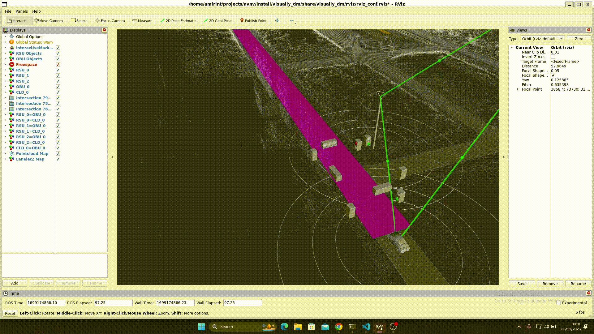

# visually_dm

This package provides a tool to visualise the experiments done on cooperative autonomous vehicles based on Japan's DM standards. It includes many key components involved in the field such as RSUs and Cloud mediators. We use ROS2 humble's RViz for the visualisation purposes.




## Dependencies

- [ROS2 humble](https://docs.ros.org/en/humble/)
- [GeographicLib](https://geographiclib.sourceforge.io/C++/doc/install.html#cmake)
- [dm_msgs](https://github.com/AmirInt/dm_msgs)
- [autoware_auto_msgs](https://github.com/AmirInt/autoware_auto_msgs)
- [autoware_adapi_msgs](https://github.com/AmirInt/autoware_adapi_msgs)
- [autoware_common](https://github.com/AmirInt/autoware_common)
- [minimal_autoware_msgs](https://github.com/AmirInt/minimal_autoware_msgs)
- [minimal_tier4_autoware_msgs](https://github.com/AmirInt/minimal_tier4_autoware_msgs)
- [lanelet2_loader](https://github.com/AmirInt/lanelet2_loader)
- [rviz_visual_tools](https://github.com/PickNikRobotics/rviz_visual_tools)
- [PCL](https://pointclouds.org/)

## Build

### Install GeographicLib:

Get the GeographicLib source code.
```
wget https://github.com/geographiclib/geographiclib/archive/refs/tags/v2.3.zip
```

Unzip the package.
```
unzip v2.3.zip
```

Build and install the package.
```
cd geographiclib-2.3
mkdir build
cd build
cmake ..
make
sudo make install
```

### Install rosdep

```
sudo apt install python3-rosdep
sudo rosdep init
rosdep update
```

### Install visually_dm

Navigate to your desired directory and create a ROS2 workspace:
```
mkdir -p ros2_ws/src && cd ros2_ws/src
```

Clone the repositories:
```
git clone git@github.com:AmirInt/dm_msgs.git
git clone git@github.com:AmirInt/autoware_auto_msgs.git
git clone git@github.com:AmirInt/autoware_adapi_msgs.git
git clone git@github.com:AmirInt/autoware_common.git
git clone git@github.com:AmirInt/minimal_autoware_msgs.git
git clone git@github.com:AmirInt/minimal_tier4_autoware_msgs.git
git clone git@github.com:AmirInt/lanelet2_loader.git
git clone git@github.com:AmirInt/visually_dm.git
```

Source your ROS2 Humble:
```
source /opt/ros/humble/setup.bash
```

Resolve the ROS2 and system dependencies using [rosdep](https://docs.ros.org/en/humble/Tutorials/Intermediate/Rosdep.html).
```
cd ..
rosdep install --from-paths src -y --ignore-src
```

From the root of your workspace, use [colcon](https://github.com/colcon) to build all packages:
```
colcon build
```

## Run

### Application

From the root of your workspace, source your ROS2 workspace:
```
. install/setup.bash
```

Launch the application:
```
ros2 launch visually_dm visualiser.launch.py
```

### Sample ROSBAG data

The package is provided with a sample ROSBAG data located in the `sample_data` directory. To play the ROSBAG, use ROS built-in CLI commands in a separate workspace-sourced terminal:

```
ros2 bag play path/to/rosbag_file.db3
```

## Note

You need to configure the launch file located at `visually_dm/launch/visualiser.launch.py` based on your needs. After modifying the launch file you have to build the visually_dm package again. So, from the root of your ROS2 workspace, run:
```
colcon build --packages-select visually_dm
```